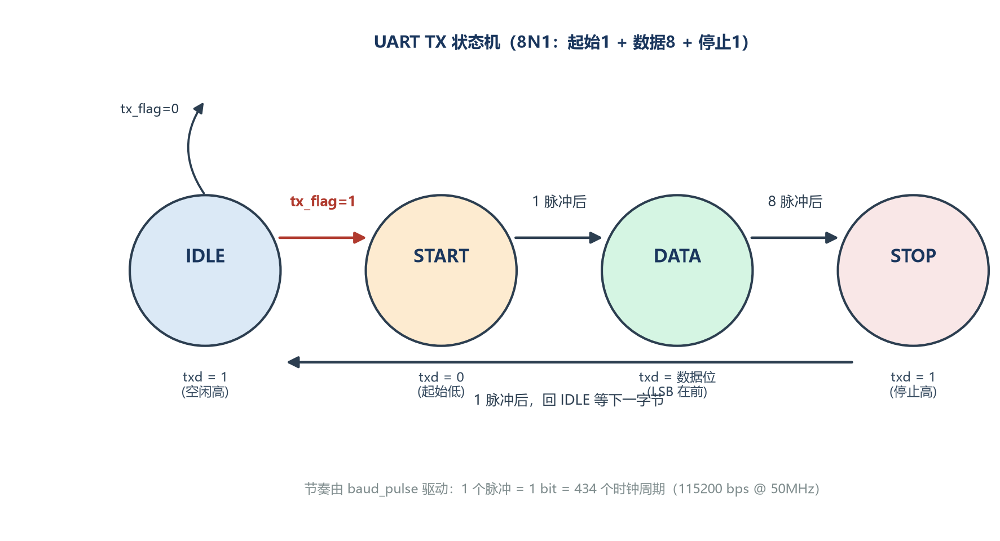
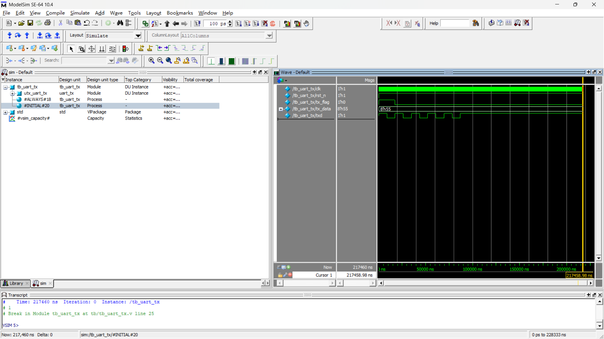

# UART 发送模块仿真全记录：一帧 0x55 的旅程

> 84 天 FPGA 学习计划 · 第 7 天
> 目标：给 UART 发送模块写测试平台（TB），跑仿真，用波形和时间戳验证一帧数据完全正确。

## 一、背景：UART 是什么

UART 是最常见的**异步**串行通信协议——没有时钟线，收发双方靠**约定波特率**对齐节奏。我用的参数是 8N1：

- **8N1 帧 = 起始位 1 + 数据位 8 + 停止位 1 = 10 bit**
- 空闲时总线保持**高电平**
- **起始位**：拉低 1 bit，告诉接收方"我要开始了"
- **数据位**：8 位，**LSB（最低位）在前**
- **停止位**：恢复高电平 1 bit，一帧结束

系统时钟 50 MHz，波特率 115200：分频值 50M / 115200 = 434.03，数 0~433 共 434 个时钟周期，即 **每 bit = 434 周期 = 8680 ns**。

## 二、发送模块：状态机设计



四个状态，一个"节拍器"驱动：

| 状态 | 作用 | txd 输出 |
|------|------|---------|
| IDEL | 空闲等待 | 高 |
| START | 起始位 | 低 |
| DATA | 8 位数据（LSB 在前） | shift[cnt] |
| STOP | 停止位 | 高 |

设计要点：
1. **时钟使能思想**：状态机只在 `baud_pulse` 到达的时钟沿动作，绝不自己造时钟
2. **快照/打包**：进入 DATA 前把 `tx_data` 装进 `shift`，防止外部中途改数据
3. **计数器索引**：DATA 状态用 `txd = shift[cnt]` 逐位输出，cnt 从 0 数到 7

## 三、测试平台（TB）：模拟"上游模块"

TB 的职责：喂时钟、复位，然后**扮演主人**——把 `tx_flag` 和 `tx_data` 递给发送模块。

```verilog
initial begin
    #100 rst_n = 1;          // 1. 先释放复位
    tx_data = 8'b01010101;   // 2. 再装货（0x55，先货后令）
    tx_flag = 1;             // 3. 最后按发车铃
    #17360 tx_flag = 0;      //    按 2 bit 时间，保证被接住
    #200000 $finish;         //    仿真 200μs，够发完整帧
end
```

0x55 是经典测试图案：0101_0101 加上起始位 0 和停止位 1，**整帧正好 0-1 完美交替**，波形一眼就能看出节奏对不对。

## 四、仿真验证：波形 + 时间戳双证据

### 波形证据



波形里能清楚看到完整一帧：空闲高 → **起始低** → **1 0 1 0 1 0 1 0**（LSB 在前）→ **停止高**，每个位的宽度完全相等。

### 时间戳铁证（$monitor 日志，单位 ps，÷1000 为 ns）

| 时刻(ns) | txd | state | 含义 |
|---------|-----|-------|------|
| 8790 | 0 | START | 起始位开始 |
| 17470 | 1 | DATA | D0=1 |
| 26150 | 0 | DATA | D1=0 |
| 34830 | 1 | DATA | D2=1 |
| 43510 | 0 | DATA | D3=0 |
| 52190 | 1 | DATA | D4=1 |
| 60870 | 0 | DATA | D5=0 |
| 69550 | 1 | DATA | D6=1 |
| 78230 | 0 | DATA | D7=0 |
| 86910 | 1 | STOP | 停止位开始 |
| 95590 | 1 | IDEL | 帧结束 |

核对结果：
- **每个位宽 = 8680 ns = 434 个时钟周期**（分毫不差）
- **数据序列 1,0,1,0,1,0,1,0 = 0x55 LSB 在前**（正确）
- **全帧 86800 ns = 10 bit × 8680**（正确）

## 五、踩坑记录（写给以后的自己）

1. **8'd 和 8'b 是两种进制**：`8'd01010101` 是十进制 101 万，溢出截断成 0xB5；要写 `8'b01010101` 或 `8'h55`
2. **flag 按太短 = 没人听见**：状态机只在 baud_pulse 的时钟沿"看一眼" flag，按 100ns 就松手等于白按，至少要按满 1 bit（8680ns）
3. **模块 output 端口只能接 wire**：TB 里 `txd` 必须声明 wire（谁驱动谁决定），写 reg 编译直接报错
4. **读 Log 要读"txd 变化的那一行"**：baud_pulse 是寄存器输出，uart_tx 晚一个时钟沿才动作，baud 行比 txd 行早 20ns
5. **$time 单位是 ps**：`timescale 1ns/1ps` 下 $time 按精度返回，读数 ÷1000 才是 ns
6. **游标点击有精度误差**：量位宽别靠游标，$monitor 时间戳才是铁证

## 六、下一步

接收模块（RX）、收发环回、自动比对 TB——让 TB 自己判断 PASS/FAIL。
